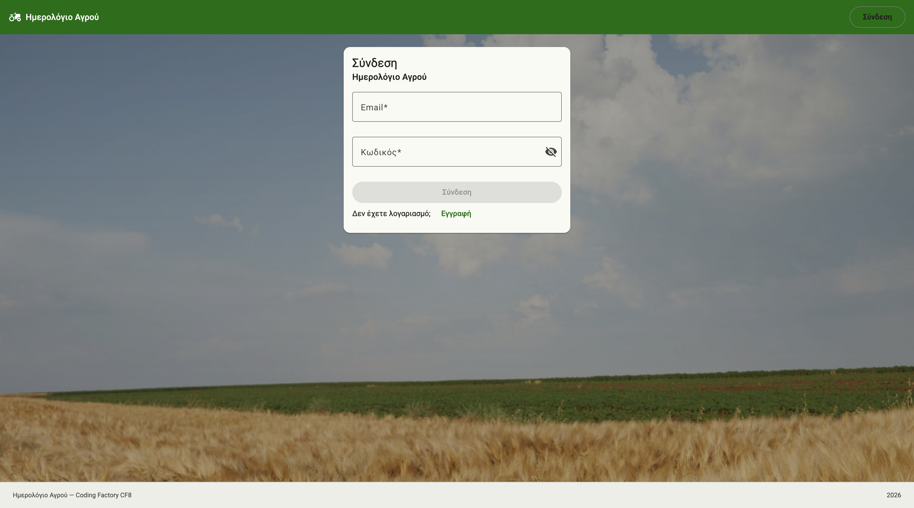
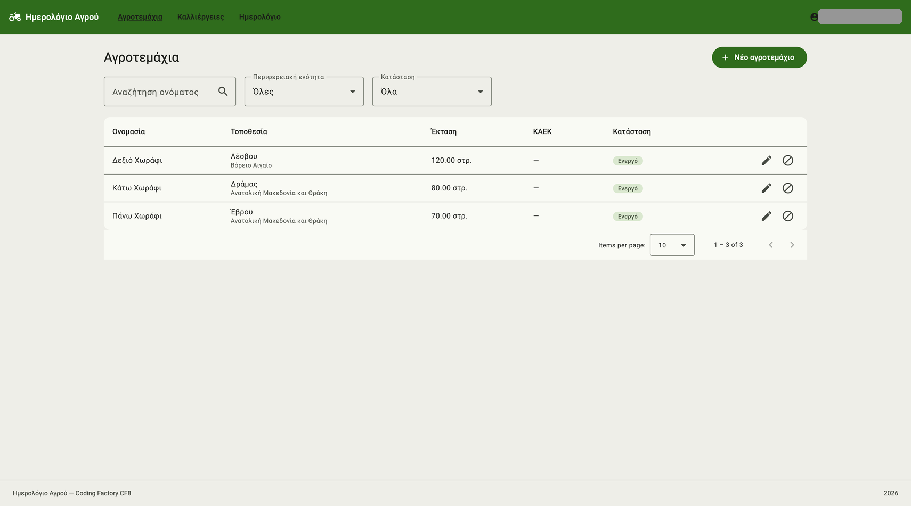
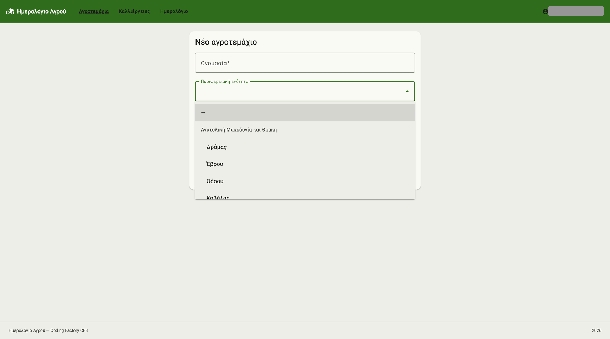
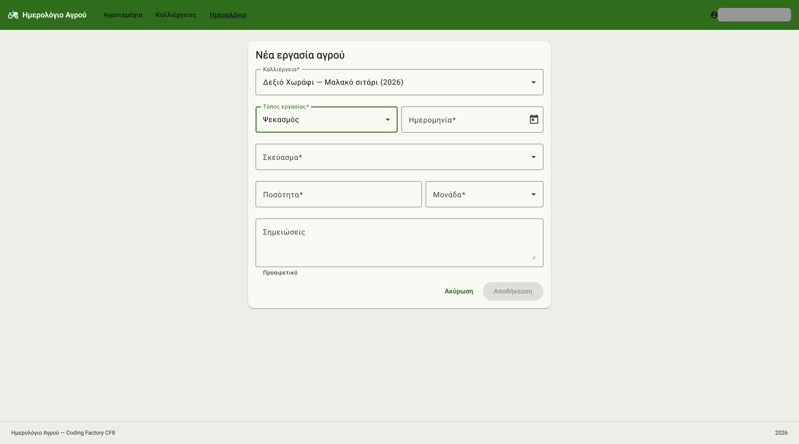
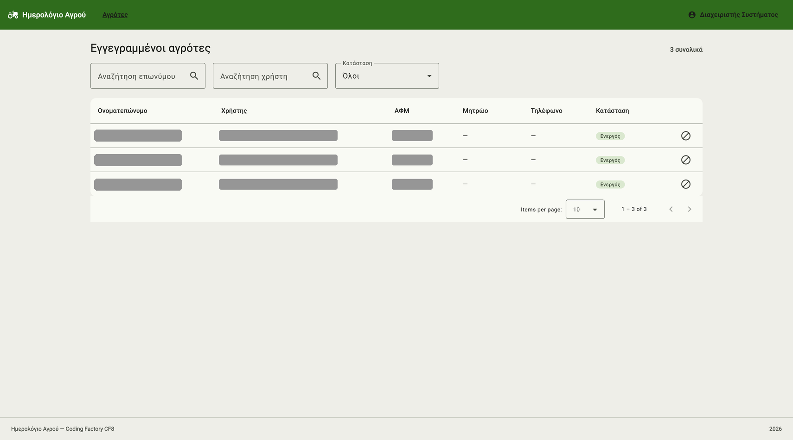

# AgriApp Frontend — Ψηφιακό Ημερολόγιο Αγρού

Πελάτης σε Angular για το [AgriApp](https://github.com/dimitris418/agri-project),
το REST API τήρησης ημερολογίου καλλιεργητικών εργασιών σε σιτηρά.

Ο αγρότης συνδέεται, δηλώνει τα αγροτεμάχιά του, ανοίγει καλλιέργειες ανά
περίοδο και καταγράφει τις εργασίες που εκτελεί: ψεκασμούς, λιπάνσεις,
αρδεύσεις, παρατηρήσεις εχθρών και ασθενειών, και τη συγκομιδή. Ο διαχειριστής
βλέπει τους εγγεγραμμένους λογαριασμούς και μπορεί να τους απενεργοποιήσει.

Αποτελεί το front-end μέρος της τελικής εργασίας για το Coding Factory. Το
back-end βρίσκεται σε ξεχωριστό repository και πρέπει να τρέχει για να
λειτουργήσει η εφαρμογή.

## Τεχνολογίες

- Angular 22 — standalone components, signals, zoneless change detection
- TypeScript 6
- Angular Material 22 (Material 3) για τα components
- Bootstrap 5 — **μόνο το grid**, όχι ολόκληρο το framework
- RxJS 7
- Vitest με jsdom
- Node.js 22, npm 11

## Στήσιμο

```bash
npm install
```

Η εφαρμογή δεν έχει δικά της secrets. Η μόνη ρύθμιση είναι η διεύθυνση του API,
σε δύο αρχεία:

| Αρχείο | `apiUrl` | Πότε ισχύει |
|---|---|---|
| `src/environments/environment.development.ts` | `http://localhost:8080/api` | `ng serve` |
| `src/environments/environment.ts` | `/api` | production build |

Στην παραγωγή η σχετική διαδρομή προϋποθέτει ότι το API σερβίρεται από το ίδιο
origin, μέσω reverse proxy. Το back-end επιτρέπει CORS από
`http://localhost:4200` — αν αλλάξεις θύρα, άλλαξε και το
`app.cors.allowed-origins` εκεί.

## Εκτέλεση

```bash
ng serve
```

Η εφαρμογή ανοίγει στο `http://localhost:4200`. **Χρειάζεται το back-end
σηκωμένο** στη θύρα 8080· χωρίς αυτό η σύνδεση αποτυγχάνει με μήνυμα ότι ο
διακομιστής δεν αποκρίνεται.

Δεν υπάρχει προεγκατεστημένος λογαριασμός αγρότη: η εγγραφή από το `/register`
είναι δημόσια. Ο λογαριασμός διαχειριστή δημιουργείται από το back-end, με
μεταβλητές περιβάλλοντος — δες το README του.

### Tests

```bash
ng test --watch=false
```

74 tests σε 24 αρχεία, με Vitest και jsdom. Καλύπτουν τα services έναντι
`HttpTestingController`, τους guards, τον interceptor, τον date adapter, και
για κάθε οθόνη τις κρίσιμες διαδρομές: απόδοση γραμμών, φίλτρα, υποβολή φόρμας,
χειρισμό σφαλμάτων.

### Build

```bash
ng build
```

## Οθόνες

**Σύνδεση.** Κοινή φόρμα για αγρότες και διαχειριστές· ο ρόλος προκύπτει από το
token μετά την ταυτοποίηση.



**Αγροτεμάχια.** Λίστα με σελιδοποίηση, ταξινόμηση και φίλτρα ονομασίας,
περιφερειακής ενότητας και κατάστασης.



**Φόρμα αγροτεμαχίου.** Η τοποθεσία επιλέγεται από κατάλογο εβδομήντα τεσσάρων
περιφερειακών ενοτήτων, ομαδοποιημένων ανά περιφέρεια.



**Φόρμα εργασίας.** Τα πεδία αλλάζουν ανάλογα με τον τύπο: ο ψεκασμός ζητάει
σκεύασμα και δόση, η παρατήρηση ζητάει εχθρό και ένταση.



**Διαχειριστική λίστα.** Οι εγγεγραμμένοι αγρότες, με αναζήτηση και
ενεργοποίηση ή απενεργοποίηση λογαριασμού.



## Δομή

```
src/app
├── core
│   ├── guards        authGuard, roleGuard
│   ├── interceptors  authInterceptor
│   ├── models        interfaces αντίστοιχα των DTO του back-end
│   ├── services      Auth, Farmer, Parcel, Crop, FieldActivity, Lookup
│   └── utils         μετατροπές ημερομηνίας, GreekDateAdapter
├── features
│   ├── activities    λίστα και φόρμα ημερολογίου
│   ├── admin         λίστα αγροτών
│   ├── auth          σύνδεση, εγγραφή
│   ├── crops         λίστα και φόρμα καλλιεργειών
│   ├── home          αρχική, ανά ρόλο
│   ├── parcels       λίστα και φόρμα αγροτεμαχίων
│   └── profile       το προφίλ του αγρότη
├── layout            header, footer
└── shared            διάλογος επιβεβαίωσης
```

Κάθε οθόνη φορτώνεται τεμπέλικα με `loadComponent`, οπότε ο αρχικός bundle
περιέχει μόνο το κέλυφος και την αυθεντικοποίηση.

## Σχεδιαστικές αποφάσεις

**Standalone components, χωρίς NgModules.** Κάθε component δηλώνει μόνο του τι
εισάγει. Είναι ο τρόπος που συνιστά η Angular από την έκδοση 17 και μετά, και
κάνει περιττό ένα ολόκληρο επίπεδο αρχείων.

**Signals αντί για ροές παντού.** Η κατάσταση των οθονών (`rows`, `total`,
`loading`) είναι signals, και ό,τι παράγεται από αυτήν είναι `computed`. Το
RxJS μένει εκεί που ανήκει: στις κλήσεις HTTP και στο `debounceTime` των
φίλτρων.

**Η συνεδρία στο localStorage.** Επιβιώνει του refresh, που είναι το ζητούμενο.
Το κόστος είναι ότι ένα XSS θα μπορούσε να διαβάσει το token· η εναλλακτική
του httpOnly cookie απαιτεί αλλαγές στο back-end και προστασία CSRF. Η επιλογή
είναι σημειωμένη και στον κώδικα.

**Δρομολόγηση ανά ρόλο, εξουσιοδότηση ανά capability.** Ο `roleGuard` και το
μενού κρύβουν ό,τι δεν αφορά τον χρήστη — αλλά αυτό είναι θέμα εμπειρίας, όχι
ασφάλειας. Την εξουσιοδότηση την επιβάλλει το back-end με βάση τα capabilities
του ρόλου· κανένα token δεν ξεκλειδώνει endpoint επειδή το front-end άφησε τον
χρήστη να δει την οθόνη.

**Δικός μας `GreekDateAdapter`.** Ο `NativeDateAdapter` της Angular Material
διαβάζει τις ημερομηνίες με `Date.parse`, που ερμηνεύει το `01/08/2026` ως
8 Ιανουαρίου. Σε ημερολόγιο ψεκασμών αυτό δεν είναι ενόχληση, είναι αθόρυβη
αλλοίωση δεδομένων. Ο δικός μας adapter διαβάζει αυστηρά `ηη/μμ/εεεε` και
απορρίπτει ημερομηνίες που δεν υπάρχουν.

**Μετατροπή ημερομηνιών χωρίς `toISOString()`.** Το `toISOString()` μετατρέπει
σε UTC, οπότε μια ημερομηνία επιλεγμένη τα μεσάνυχτα ώρα Ελλάδας γίνεται η
προηγούμενη μέρα. Οι συναρτήσεις στο `core/utils/date.ts` δουλεύουν με τα
τοπικά μέρη της ημερομηνίας.

**Οι κανόνες της φόρμας εργασίας αντιγράφουν τον server, δεν τον
αντικαθιστούν.** Ένας πίνακας κανόνων προσθέτει και αφαιρεί validators ανάλογα
με τον τύπο εργασίας, ώστε ο χρήστης να μη στέλνει αίτημα που θα απορριφθεί.
Την τελική απόφαση την έχει πάντα το back-end, και το μήνυμά του εμφανίζεται
αυτούσιο όταν χτυπήσει κάποιος κανόνας.

**Η προειδοποίηση χρόνου αναμονής είναι συμβουλευτική.** Όταν η ημερομηνία μιας
εργασίας πλησιάζει την αναμενόμενη συγκομιδή, η φόρμα προειδοποιεί αλλά δεν
μπλοκάρει: η αναμενόμενη ημερομηνία είναι εκτίμηση του παραγωγού, ενώ ο
δεσμευτικός έλεγχος γίνεται στο back-end με βάση την πραγματική συγκομιδή.

**Material για components, Bootstrap μόνο για grid.** Φορτώνεται το
`bootstrap-grid.min.css`, όχι ολόκληρο το Bootstrap, ώστε να μη συγκρούονται
δύο συστήματα σχεδίασης. Τα χρώματα και οι τυπογραφίες προέρχονται αποκλειστικά
από τις μεταβλητές `--mat-sys-*` του θέματος Material 3.

**Τα κενά φίλτρα δεν φεύγουν ως query parameters.** Κάθε service καθαρίζει τα
`undefined`, `null` και `''` πριν συνθέσει τα `HttpParams`. Διαφορετικά το
back-end θα τα δεχόταν ως φίλτρα με κενό περιεχόμενο.

## Γνωστοί περιορισμοί

**Δεν υπάρχει refresh token.** Η συνεδρία ζει όσο και το JWT, τρεις ώρες. Μετά
ο χρήστης ξανασυνδέεται. Ένα 401 σε οποιοδήποτε αίτημα τον αποσυνδέει αυτόματα.

**Η εφαρμογή δεν είναι διεθνοποιημένη.** Τα ελληνικά είναι γραμμένα απευθείας
στα templates, χωρίς `@angular/localize`. Για μία γλώσσα η υποδομή i18n θα
πρόσθετε πολυπλοκότητα χωρίς όφελος.

**Δεν λειτουργεί εκτός σύνδεσης.** Ένα ημερολόγιο αγρού θα ωφελούνταν από
καταγραφή χωρίς δίκτυο και συγχρονισμό αργότερα, αλλά αυτό απαιτεί service
worker και στρατηγική επίλυσης συγκρούσεων.

**Δεν υπάρχει διαχείριση των καταλόγων από το UI.** Τα είδη καλλιεργειών, τα
σκευάσματα, οι εχθροί και οι περιφερειακές ενότητες διαβάζονται μόνο· η
συντήρησή τους γίνεται στη βάση.

## Πηγές υλικού

Η φωτογραφία στο φόντο των οθονών σύνδεσης και εγγραφής
(`public/images/field.jpg`) είναι του **Meriç Tuna** και προέρχεται από το
[Pexels](https://www.pexels.com/photo/30556729/), υπό την
[άδεια του Pexels](https://www.pexels.com/license/). Έχει περικοπεί σε
1920×1280 και συμπιεστεί για χρήση στο web.
